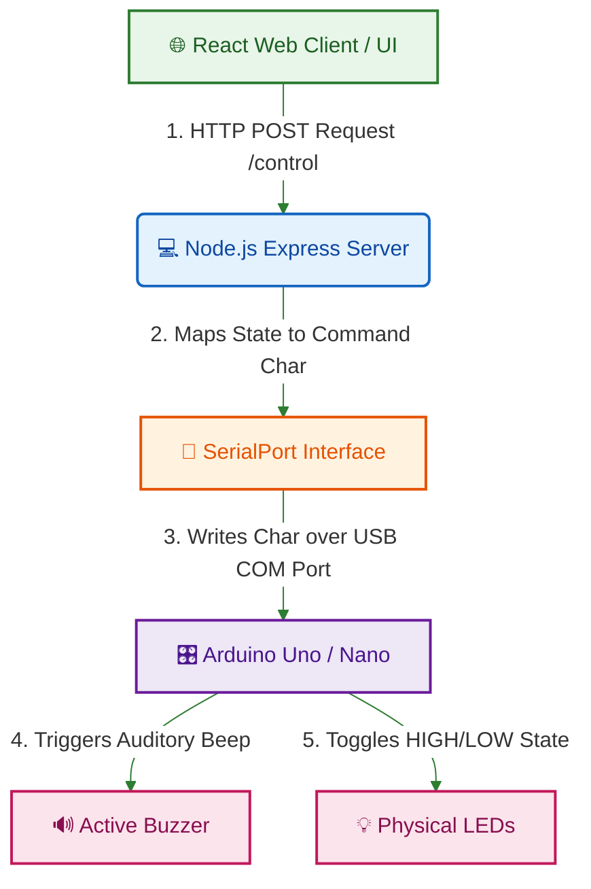

# 💡 Smart Energy Control System

### *Full-Stack IoT Home Automation & Energy Management System*

---

<div align="center">
  
  
  
  
</div>

---

## 🌟 Project Overview

The **Smart Energy Control System** is a production-ready, full-stack IoT dashboard designed to monitor and control physical home appliances or power sectors remotely. By integrating a responsive **React 19 / TypeScript** web client, a **Node.js Express** backend API gateway, and dedicated **Arduino C++** microcontroller firmware, the system bridges the gap between software dashboards and hardware switches.

This architecture serves as a foundational prototype for modern smart homes, enabling administrators to authenticate securely, view real-time appliance states, trigger physical circuits, and receive sensory feedback instantly.

---

## 📊 System Architecture & Data Flow

The following colored layout traces how an interaction on the web client traverses the backend service, travels over the serial port, and operates the physical relays:



---

## 🛠️ Hardware Requirements & Pin Out

To replicate this physical circuit, connect the following components to your Arduino microcontroller. Ensure you include standard **220Ω current-limiting resistors** in series with each LED to prevent burnout.

| Actuator / Component | Arduino Pin | Circuit Description | State Character |
| :--- | :--- | :--- | :--- |
| **💡 LED 1** | **Pin 13** | Status Indicator / Zone 1 Power Relay | `A` (ON) / `a` (OFF) |
| **💡 LED 2** | **Pin 12** | Status Indicator / Zone 2 Power Relay | `B` (ON) / `b` (OFF) |
| **💡 LED 3** | **Pin 11** | Status Indicator / Zone 3 Power Relay | `C` (ON) / `c` (OFF) |
| **🔊 Buzzer** | **Pin 8** | Active Buzzer for instant audio receipt feedback | Short Beep on command |

---

## 🚀 Installation & Local Deployment

### 📋 Prerequisites
Ensure you have the following installed:
* [Node.js](https://nodejs.org/) (v18.0.0 or higher)
* [Arduino IDE](https://www.arduino.cc/en/software)
* Git

---

### 📥 Setup Instructions

#### 1. Microcontroller Firmware Upload
1. Attach your Arduino board to your workstation via USB.
2. Open `Arduino-Code/Arduino-Code.ino` using the **Arduino IDE**.
3. Go to `Tools > Board` and select your board (e.g., *Arduino Uno*).
4. Select the matching **COM Port** from the ports list.
5. Click **Upload** to burn the sketch onto the board.

#### 2. Backend Gateway Setup
1. Navigate to the backend directory:
   ```bash
   cd backend
   ```
2. Install standard Node modules:
   ```bash
   npm install
   ```
3. **Configure Connection Port:**
   * Open `server.js` in a text editor.
   * Locate the configuration section and set your Arduino's active COM port:
     ```javascript
     const ARDUINO_PORT_PATH = 'COM5'; // Update this to match your Arduino port!
     ```
4. Fire up the backend engine:
   ```bash
   npm start
   ```
   *The Express API will initialize and bind to `http://localhost:3000`.*

#### 3. Frontend Web Interface Setup
1. Navigate to the frontend directory:
   ```bash
   cd ../frontend
   ```
2. Install client dependencies:
   ```bash
   npm install
   ```
3. **Configure API Endpoints:**
   * Open `src/App.tsx`.
   * Ensure the active API base URL points to your local backend gateway (`http://localhost:3000`) instead of ngrok tunnels.
4. Launch the web dashboard:
   ```bash
   npm run dev
   ```
   *The React UI will run locally on `http://localhost:5173` (or alternative port shown in terminal).*

---

## 🔒 Security & Credentials

For local demonstration and sandbox testing, the backend implements basic mock authorization:

* **Demo Username:** `admin`
* **Demo Password:** `password123`

> [!WARNING]
> This authentication mechanism is for sandbox and testing environments only. In a production environment, implement salted hashing (such as `bcrypt`), sign secure JSON Web Tokens (`JWT`), and persist users within a validated DB system.

---

## 📁 Repository Structure

```
├── .gitignore                    # Standardized ignore rules for node_modules, builds, logs & credentials
├── package.json                  # Root Monorepo configuration
├── package-lock.json             
├── Arduino-Code/                 # C++ Firmware directory
│   └── Arduino-Code.ino          # Microcontroller serial event loop handler
├── backend/                      # Express.js REST API & Serial Gateway
│   ├── server.js                 # API routing & SerialPort event hub
│   ├── package.json              
│   └── ngrok-backend-example.yml # Template configuration for secure ngrok tunnels
└── frontend/                     # React 19 Client Dashboard
    ├── index.html                
    ├── vite.config.ts            
    ├── package.json              
    └── src/                      # App views & React components
```
